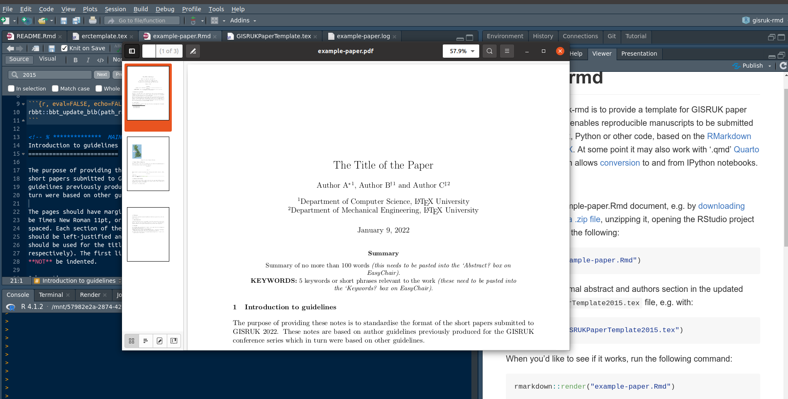
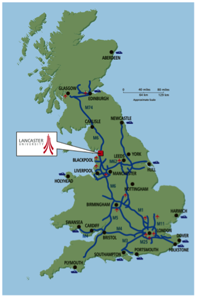

<!-- README.md is generated from README.Rmd. Please edit that file -->

```{r, include = FALSE}
knitr::opts_chunk$set(
  collapse = TRUE,
  comment = "#>",
  echo = FALSE
)
```

# gisruk-rmd

<!-- badges: start -->
<!-- badges: end -->

The goal of gisruk-rmd is to provide a template for GISRUK paper submissions that enables reproducible manuscripts to be submitted with embedded R, Python or other code, based on the [RMarkdown superset of LaTeX](https://rmarkdown.rstudio.com/).
At some point it may also work with '.qmd' [Quarto](https://quarto.org/) documents, which allows [conversion](https://quarto.org/docs/tools/jupyter-lab.html#converting-notebooks) to and from IPython notebooks.

It will create nicely formatted pdf documents, like this: https://github.com/Robinlovelace/gisruk-rmd/releases/download/0.22/example-paper.pdf and this [README as a PDF in GISRUK's style](https://github.com/Robinlovelace/gisruk-rmd/releases/download/0.22/README.pdf).

Reproduce that file and create your own reproducible geographic data analysis paper as follows:

1. Edit the example-paper.Rmd or README.Rmd file, e.g. by [downloading this repo as a .zip file](https://github.com/Robinlovelace/gisruk-rmd/archive/refs/heads/main.zip), unzipping it, opening the RStudio project and entering the following:
```r
file.edit("example-paper.Rmd")
```
2. Edit the minimal abstract and authors section in the updated `GISRUKPaperTemplate.tex` file, e.g. with:
```r
file.edit("GISRUKPaperTemplate.tex")
```

When you'd like to see if it works, run the following command:

```{r, eval=FALSE, echo=TRUE}
rmarkdown::render("example-paper.Rmd")
```

You can also press Ctrl+Shift+K in RStudio, which should result in something like this:

```{r, out.width="100%"}

```


To produce this document the original LaTeX template was downloaded as follows:

```bash
wget http://leeds.gisruk.org/paper_templates/GISRUKPaperTemplate2015-Latex.zip
unzip GISRUK*
```

See commits to see how it was modified to work as a .Rmd template.

To show it can output in any format the below is a modified example from the original.
See Python code below, which results in Figure \@ref(fig:plot1).

```{r, eval=FALSE}
reticulate::py_install("matplotlib")
reticulate::py_install("cartopy")
reticulate::py_install("descartes")
```


```{python plot1, fig.cap="Made with Python", echo=TRUE}
import matplotlib.pyplot as plt
import geopandas
from cartopy import crs as ccrs

path = geopandas.datasets.get_path('naturalearth_lowres')
df = geopandas.read_file(path)
# Add a column we'll use later
df['gdp_pp'] = df['gdp_md_est'] / df['pop_est']
df.plot()
```


Introduction to guidelines
==========================

The purpose of providing these notes is to standardise the format of the
short papers submitted to GISRUK 2022. These notes are based on author
guidelines previously produced for the GISRUK conference series which in
turn were based on other guidelines.

The pages should have margins of 2.5 cm all round. The base font should
be Times New Roman 11pt, or closest equivalent and text should be single
spaced. Each section of the paper should be numbered. Section headings
should be left-justified and given in bold type. A slightly larger font
should be used for the title of the paper and the authors (16pt and 14pt
respectively). The first line of each paragraph in each section should
**NOT** be indented.

Sub-sections
------------

Sub-sections should also be numbered as shown here. The sub-section
heading should be left-justified and given in bold type (11pt).

Figures, Tables and Equations,
==============================

Equations should be centred on the page and numbered consecutively in
the right-hand margin, as below. They should be referred to in the text
as Equation [\[first_equation\]](#first_equation){reference-type="ref"
reference="first_equation"}.

$$E=mc^2
\label{first_equation}$$

Figures should be presented as an integral part of the paper and should
be referred to as
Figure [\[first_figure\]](#first_figure){reference-type="ref"
reference="first_figure"} in the text.


<!-- Original LaTeX: -->
<!-- \begin{figure}[htbp] \begin{center}  -->
<!-- \resizebox{0.3\textwidth}{!}{  -->
<!-- 	\includegraphics{lancaster.png} -->
<!-- } \caption{Location of Lancaster University} \label{first_figure} \end{center} \end{figure} % -->

```{r lancaster, fig.cap="Location of Lancaster University", out.width="30%", fig.align='center'}

```

References and Citations
========================

A list of references cited should be provided at the end of the paper
using the Harvard format as shown below. Citations of these within the
text should be given as follows: papers such as [@openshaw_view_1991] or
a paper by @rey_show_2009.

Books can also be cited [@graser_learning_2014].

File format
===========

Papers should be submitted in unrestricted **pdf** format. Authors are
requested to keep to the word limit of 1500 words.

Acknowledgements
================

Acknowledgement should be made of any funding bodies who have supported
the work reported in the paper, of those who have given permission for
their work to be reproduced or of individuals whose particular
assistance is due recognition. Acknowledge data providers here where
appropriate.

Biography
=========

All contributing authors should include a biography of no more than 50
words each outlining their career stage and research interests.

# References
