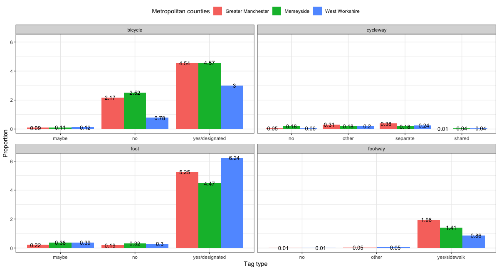
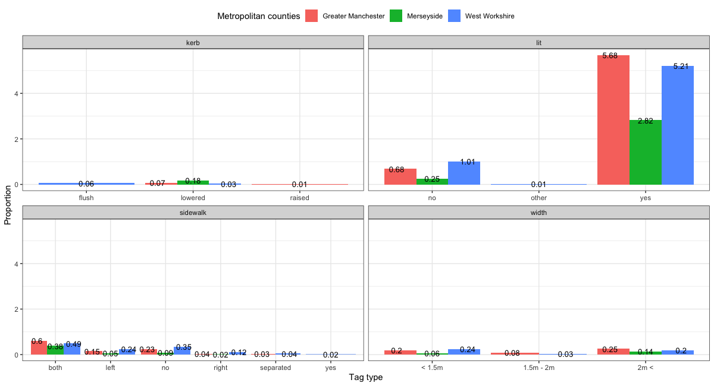

<!-- % **************  MAIN BODY OF THE PAPER ************** -->

# Introduction

Shifting the focus of transport planning interventions away from
provision for motorised modes and towards active modes (walking, cycling
and ‘wheeling’) offers health, economic, and environmental benefits
(Parkin 2018). Active travel can become an alternative to public
transport, vital during pandemic-induced reductions in operational
capacities. Acknowledging this, the UK government has boosted investment
in active travel[^1] over the last 2 years, recognising that the
pandemic provides an opportunity to encourage a behavioural change in
traveling patterns that could be maintained after the pandemic (Laverty
et al. 2020).

For the investment to be effective, new interventions and infrastructure
must meet the needs of people walking, cycling and wheeling. Aldred,
Woodcock, and Goodman (2016) argued that merely increasing cycling
levels does not always lead to increased diversity cycling
participation. Therefore, it is important for policy to explicitly
address different needs of (potential) cyclists and active travelers in
general. The invitation for the public to engage in the decision-making
is one of the potential ways to understand what needs to be implemented
to encourage active travel.

The Propensity to Cycle Tool (PCT) (Lovelace et al. 2017), an
open-source tool for strategic cycle network planning, is a good example
of an accessible tool designed for both policy makers and citizens to
make data-driven decisions regarding cycling investments. Arguably,
another approach to solidify bottom-up approach to decision making is to
encourage not only the development and use of open-source tools but also
to encourage contribution to the generation and use of open-access data
that could be used for planning transport infrastructure.

## OpenInfra and OpenStreetMap

OpenInfra is a 12-month project run at the University of Leeds which
aims to explore the potential use of open-access data for transport, and
specifically active travel, research. For this, OpenStreetMap (OSM) has
been chosen as a case study. It has been estimated that road data in OSM
is over 80% complete (Barrington-Leigh and Millard-Ball 2017).
Problematically, road data was operationalized as “vehicle circulation”,
hence excluding non-vehicle paths, such as walking and, based on the
used highway tags, cycling. It should be noted that this limitation was
acknowledged by noting that non-vehicle paths (e.g., pedestrian paths)
were also found to be increasingly mapped.

OSM has been used to plan both cycling and pedestrian networks. It has
also been utilized to plan accessible pedestrian infrastructure, but its
potential is limited by the incomplete information, such as on sidewalk
attributes (Mobasheri et al. 2018). Increasing the quality and quantity
of OSM data needed for accessible pedestrian network planning might lead
to cheaper, if not free, assistive technology for people with
disabilities (Boularouk, Josselin, and Altman 2017) who often have lower
median incomes compared to people without disabilities (Francis-Devine
2021).

# Data, tools, and methods

Data for this project was queried using `osmextract` package (Gilardi
and Lovelace 2021) in R. Three areas were chosen as case studies (for
data sizes see Table 1):

1.  West Yorkshire: it is the area about which the team has local
    knowledge that supports “sense-making” of OSM.
2.  Greater Manchester: the recent proposal to deliver the most
    comprehensive active travel network (see Transport for Greater
    Manchester (2018)) makes it an interesting case-study and a less
    computationally-intensive alternative to London.
3.  Merseyside: not only an area where GISRUK 2022 takes place but also
    a metropolitan county whose citizens, given recent Active Travel
    Protest in Liverpool[^2], could benefit from open access data to
    push for data-driven and evidence-based decision making.

Exploratory data analysis (EDA) was used to make sense of the existing
data. There is no single concept of EDA (Hullman and Gelman 2021) and
currently there are attempts to rethink EDA in the context of
geographical analysis (Beecham and Lovelace 2022). In this case, EDA was
used to explore what data is missing and how the present data can be
utilized for (accessible) active travel research. For this, bar charts
were chosen to show the proportion of a tag to all the highways
(excluding motorways and motorway links as pedestrians and cyclists
cannot use them in the UK) in a given metropolitan county. Moreover, to
reduce the number of bins and account for duplicate information (e.g.,
“no” and “none”), tags in Figure 2 and Figure 3 were recategorized.
Finally, for each bar plot displayed in the paper there is an
accompanying interactive map that can be explored to learn more about
the geospatial distribution of data.

The reproducible code can be found in OpenInfra GitHub repository:
<https://github.com/udsleeds/openinfra>

# Results

It is evident that OSM provides a comprehensible, if not complete,
network of highways. Footways stand out for constituting about ¼ of all
the mapped highways in all three metropolitan counties. Given Greater
Manchester’s proposal to provide the most comprehensive cycling and
walking network in Britain, it is surprising that it does not have, in
proportion to all the highways mapped in Greater Manchester, more
footways and only slightly more cycleways compared to West Yorkshire and
Merseyside. One could argue that *footways* take a specific semantic
meaning of representing minor pathways, hence does not represent an
entire walking network. Nevertheless, it does not seem that Greater
Manchester has, for instance, more living streets or pedestrianized
roads either.

<!-- Original LaTeX: -->
<!-- \begin{figure}[htbp] \begin{center}  -->
<!-- \resizebox{0.3\textwidth}{!}{  -->
<!--    \includegraphics{all_plot2.png} -->
<!-- } \caption{Proportions of different highways in OSM} \label{first_figure} \end{center} \end{figure} % -->

Arguably the key “selling point” of OSM data is not the information on
the types of highways but the available attributes about them. For
instance, bicycle and foot tags indicate if the highways are accessible,
accordingly, to cyclists and pedestrians (Figure 2). In this way shared
spaces might be represented. Interestingly, there seems to be a tendency
to provide more information on the road accessibility to cyclists. The
reasons behind this difference is beyond the scope of this paper as it
would involve an examination of OSM mapping practices but it is likely
that cyclists, in general, experience more legal restrictions, hence
leading to an increased awareness of the importance to provide this
data.

<!-- Original LaTeX: -->
<!-- \begin{figure}[htbp] \begin{center}  -->
<!-- \resizebox{0.3\textwidth}{!}{  -->
<!--    \includegraphics{joined_plot3.png} -->
<!-- } \caption{The proportion of relevant tags for active travel to all highways mapped in OSM} \label{second_figure} \end{center} \end{figure} % -->

Echoing Mobasheri et a.’s (2017) observation regarding limited data on
sidewalks, it can be argued that the problem persists. Ideally, one
would expect a majority of footways to have the presence (or absence) of
a sidewalk tagged given that the current convention of OSM is provide
this data[^3]:

`highway = footway`

`footway = sidewalk`

`sidewalk = [relevant value]`

The data becomes even more scarce if one seeks for more refined
information about sidewalks, e.g., if it is on the left or right side of
a road (see Table 3). It seems to be on par with cycleway tag, which
contains similar information to sidewalk. It is hard to explain why
there is a drop in information availability, yet one potential reason
might be linked to straightforwardness of providing information. For
example, it might be easier to judge the presence of sidewalk on both
sides that evaluate if it is on the right or left side of the road[^4].

<!-- Original LaTeX: -->
<!-- \begin{figure}[htbp] \begin{center}  -->
<!-- \resizebox{0.3\textwidth}{!}{  -->
<!--    \includegraphics{joined_plot4.png} -->
<!-- } \caption{The proportion of relevant tags for accessible active travel to all highways mapped in OSM} \label{third_figure} \end{center} \end{figure} % -->

Finally, OSM has the potential to represent highway features essential
for accessible (pedestrian) network planning (see Table 3). For example,
kerb height and sidewalk width are essential street elements for people
using wheelchairs to move around while lighting is important to vision
impaired people. In this context, width tag has been recategorized using
the most recent Inclusive Mobility guide (Department for Transport
2021). While currently there is too little information for the tags to
be taken advantage of, but, given accurate data is present in the
future, it could be used to assess which sidewalks are wide enough to
comply with the existing guidance. In comparison to width and kerb tags,
there is surprisingly a lot of information on the presence of lighting.
The lit tag does not capture the information on, for example, minimum
illumination level as outlined in the Inclusive Mobility guide, but it
still could be used to evaluate, e.g., highway’s safety.

# Discussion and future directions

The EDA has shown that OSM does offer an extensive network of highways,
however it is still limited by the missing data on highway attributes.
For example, ideally every footway had information on the
presence/absence of sidewalk. The lack of data is even more evident for
the attributes relevant for accessible infrastructure. In all three case
studies there is barely any information on kerb height or sidewalk width
that are essential for accessible (pedestrian) network. Regardless of
the current limitations of OSM data, the authors still believe that if
more detailed information on highways is provided (by both encouraging
current and new mappers to provide attribute data of their local areas),
OSM holds the potential to support data-driven evidence-based decision
making.

Given that, the OpenInfra project team will further explore the
potential of OSM data. Not only the current analysis will be scaled up
to incorporate all local authorities in England but also will consider
how to make OSM data more accessible to the public and policymakers. By
the end of the project an R package will be developed to allow easier
interaction with OSM data that will include, but not limited to, data
recategorization for UK context (e.g., sidewalk width compliance with
Inclusive Mobility guide).

# Acknowledgements

Authors would like to thank ESCR for providing funding for internship.

# Biography

Greta is a data science intern at Leeds Institute for Data Analytics,
University of Leeds. She has an interdisciplinary background in
sociology and computational research methods.

# References

Aldred, Rachel, James Woodcock, and Anna Goodman. 2016. “Does More
Cycling Mean More Diversity in Cycling?” *Transport Reviews* 36 (1):
28–44. <https://doi.org/10.1080/01441647.2015.1014451>.

Barrington-Leigh, Christopher, and Adam Millard-Ball. 2017. “The World’s
User-Generated Road Map Is More Than 80% Complete.” *PLOS ONE* 12 (8):
e0180698. <https://doi.org/10.1371/journal.pone.0180698>.

Beecham, Roger, and Robin Lovelace. 2022. “A Framework for Inserting
Visually-Supported Inferences into Geographical Analysis Workflow:
Application to Road Safety Research.” OSF Preprints.
<https://doi.org/10.31219/osf.io/mfja8>.

Boularouk, Said, Didier Josselin, and Eitan Altman. 2017. “Ontology for
a Voice Transcription of OpenStreetMap Data: The Case of Space
Apprehension by Visually Impaired Persons.” In *World Academy of
Science, Engineering and Technology*. London, United Kingdom.

Department for Transport. 2021. “Inclusive Mobility: A Guide to Best
Practice on Access to Pedestrian and Transport Infrastructure.”

Francis-Devine, Brigid. 2021. “Income Inequality in the UK.” House of
Commons Library Briefing Paper.

Gilardi, Andrea, and Robin Lovelace. 2021. “Osmextract: Download and
Import Open Street Map Data Extracts. R Package Version 0.3.1.”

Hullman, Jessica, and Andrew Gelman. 2021. “Challenges in Incorporating
Exploratory Data Analysis into Statistical Workflow.” *Harvard Data
Science Review*. <https://doi.org/10.1162/99608f92.9d108ee6>.

Laverty, Anthony A, Christopher Millett, Azeem Majeed, and Eszter P
Vamos. 2020. “COVID-19 Presents Opportunities and Threats to Transport
and Health.” *Journal of the Royal Society of Medicine* 113 (7): 251–54.
<https://doi.org/10.1177/0141076820938997>.

Lovelace, Robin, Anna Goodman, Rachel Aldred, Nikolai Berkoff, Ali
Abbas, and James Woodcock. 2017. “The Propensity to Cycle Tool: An Open
Source Online System for Sustainable Transport Planning.” *Journal of
Transport and Land Use* 10 (1): 505–28.

Mobasheri, Amin, Haosheng Huang, Lívia Castro Degrossi, and Alexander
Zipf. 2018. “Enrichment of OpenStreetMap Data Completeness with Sidewalk
Geometries Using Data Mining Techniques.” *Sensors* 18 (2): 509.
<https://doi.org/10.3390/s18020509>.

Parkin, John. 2018. *Designing for Cycle Traffic: International
Principles and Practice*. London: ICE Publishing.

Transport for Greater Manchester. 2018. “Beelines: Greater Manchester’s
Cycling and Walking Infrastructure Proposal.”

[^1]: <https://www.gov.uk/government/news/2-billion-package-to-create-new-era-for-cycling-and-walking>

[^2]: <https://www.merseycycle.org.uk/active-travel-protest-liverpool/>

[^3]: also see the documentation:
    <https://wiki.openstreetmap.org/wiki/Key:footway>

[^4]: for more information on how to evaluate if something is the left
    and right side, see
    <https://wiki.openstreetmap.org/wiki/Forward_%26_backward,_left_%26_right>
