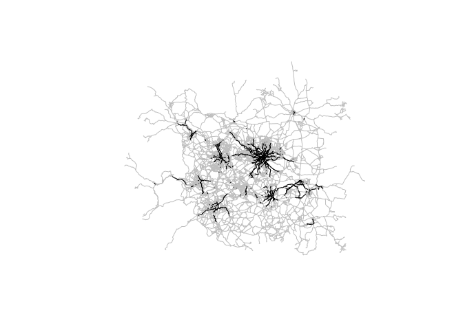

Generating route network segments to prioritise data collection
================

# Create a buffer with high cycling potential

<!-- -->

around parts of the route network with high levels of cycling under the
Government Target scenario in the PCT That will look something like
this: Pull out key bits of cycle infrastructure (of all types) from OSM
within the buffer Get fast and quiet routes that pass through the bits
of network of interest from the previous stage
