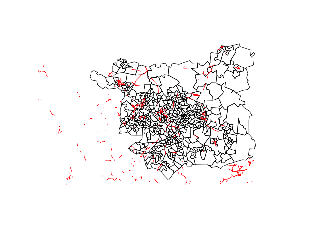
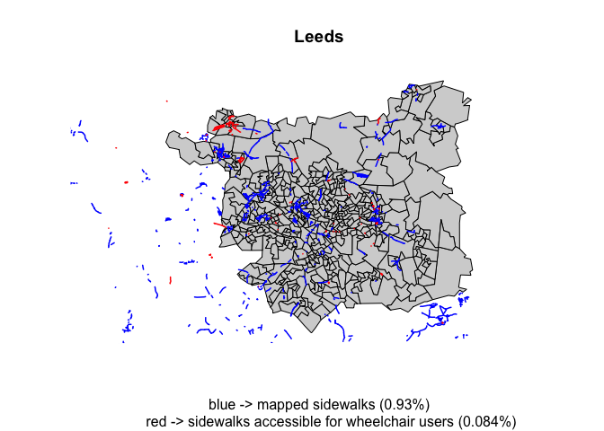
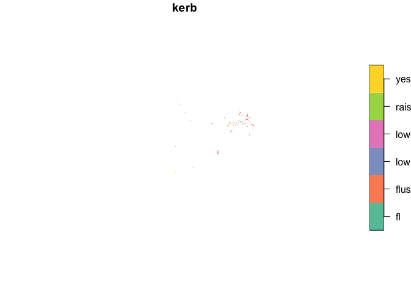
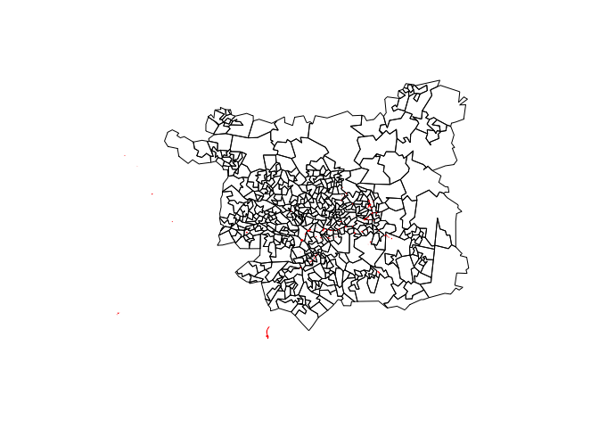
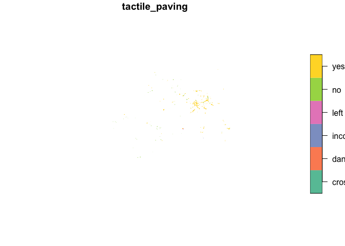
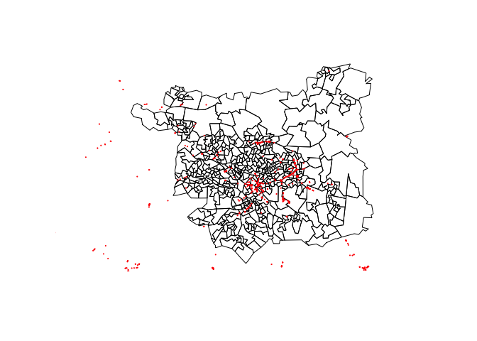
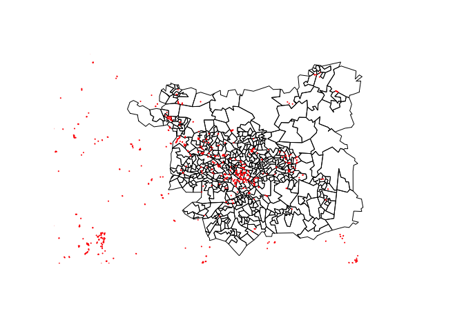
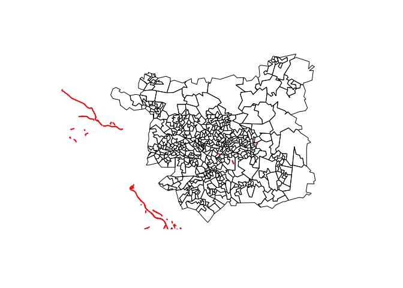
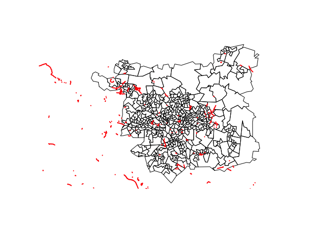

This notebook focuses on exploring OSM data related to cycling and
walking. It is limited to West Yorkshire.

# walking + accessibility

## Brief discussion of lit review on OSM, walking + accessibility

In 2017, Barrington-Leigh and Millard-Ball estimated that over 80% of
OSM road data is complete. However, the conceptualization of roads was
restricted to “vehicle circulation” (Barrington-Leigh and Millard-Ball,
2017:7). Authors (2017) note that non-vehicle modes of travel, e.g.,
walking, are excluded (based on their highway tags, cycling seems to
have been excluded as well). While the high completeness of OSM road
data is welcomed – even if completeness does not directly translate to,
for example, positional accuracy – however, it still raises a question
regarding the extent to which other ways are mapped and how open data
could be used to plan (open) infrastructure. This question is especially
important in the context of active travel in England and the current
attempts to move from motor-centric traffic to walking and cycling (see
[DfT et al.,
2020](https://www.gov.uk/government/news/2-billion-package-to-create-new-era-for-cycling-and-walking)).

It is important to note that OSM data has been utilized to map and plan
both cycling (Ferster et al., 2020; Orozco et al., 2020) and pedestrian
networks (Novack et al., 2018). Even though both cycling and walking
have substantial individual and environomental, such as improved mental
and physical health and reduced air pollution, benefits (Woodcock et
al., 2013), it can be argued that walking is more accessible because it
is free and familiar ([Ogilvie et al.,
2007](https://www.bmj.com/content/bmj/334/7605/1204.full.pdf)) and less
physically demanding ([Yang et al.,
2010](https://www.bmj.com/content/bmj/341/bmj.c5293.full.pdf)) and, thus
should be prioritized.

The potential of the OSM data in mapping and planning pedestrian routes
has been explored from a typological perspective (see Cambra et al.,
2019) and applied in evaluating and measuring walkability (Dunn et al.,
2018), generating customized pleasant pedestrian routes (Novack et et.,
2018), and even utilized to support people with disabilities in
navigating their everyday life (Mobasheri et al., 2017; Boularouk et
al., 2017; Cohen and Dalyot, 2021). However, Mobasheri et al. (2018)
note that OSM sidewalk data is incomplete, hence limiting its routing
potential for people with limited mobility. Furthermore, Boularouk et
al. (2017) point out that the ability to use OSM data might reduce the
cost of assistive technology for people with visual impairment because
data is free. In terms of key accessible road elements, Biagi et
al. (2020) identified the following:

-   sidewalk width;
-   slope;
-   kerb;
-   road signs and their height;
-   drains and other elements;
-   parking;
-   traffic lights (sound might be needed for the (partially) deaf);

Additionally, there is another difficulty posed by OSM data – tags.
Mappers are not always constrained by the values that can be assigned to
tags that are essential in defining road elements (Boularouk et
al. (2017) calls this practice folksonomy as in opposition to taxonomy;
also see Ferster et al. (2020) on labeling issues in the context of
cycling). The lack of tag homogeneity might make the application of OSM
data more challenging, however it possibly helps to keep the space open
for local interventions and bottom-up changes to what (and also how) the
world is mapped and represented. The accessibility of OSM data is one of
the benefits identified by Haklay (2010). Finally, it is important to
emphasise that mapping (including digital tools such as WheelMap) helps
to address but does not eliminate the material barriers (Rebernik et
al., 2021).

Following the overview of OSM data in relation to walking and
accessibility, in this notebook I aim to: a) map and measure the extent
to which walking infrastructure is mapped in relation to the (mapped)
highways; b) consider issues posed by tagging (such as nonsensical
values (e.g., width = -1)) c) reflect on how pedestrian network can be
conceptualized using OSM data

Other (potentially) interesting projects that focus on sidewalks +
inclusivity:

-   WheelMap
-   OpenSidewalks project
-   CAP4Access

# cycling (empty)

Tags of interest for cycling:

surface maxspeed:type width maxwidth width:lanes

bicycle cycleway cycleway:both cycleway:right cycleway:left
cycleway:both:lane cycleway:left:lane cycleway:right:lane
cycleway:left:width cycleway:right:width oneway:bicycle
cycleway:otherside  
cycleway:otherside:width cycleway:both:width cycleway:oneside
cycleway:oneside:width cycleway:right:oneway cycleway:width
cycleway:surface bicycle\_road cyclestreet cycleway:buffer
cycleway:left:separation:right bicycle:lanes:conditional
bicycle:lanes:forward:conditional cycleway:lane cycleway:left:foot
cycleway:left:oneway  
cycleway:left:segregated  
cycleway:left:seperation:right  
cycleway:proposed  
cycleway:right:separation:left “cycle” “cycleway:est\_width”

# libraries and data

## libraries

    # load up the libraries
    library(osmextract) 

    ## Data (c) OpenStreetMap contributors, ODbL 1.0. https://www.openstreetmap.org/copyright.
    ## Check the package website, https://docs.ropensci.org/osmextract/, for more details.

    library(tidyverse)

    ## ── Attaching packages ─────────────────────────────────────── tidyverse 1.3.1 ──

    ## ✓ ggplot2 3.3.5     ✓ purrr   0.3.4
    ## ✓ tibble  3.1.5     ✓ dplyr   1.0.7
    ## ✓ tidyr   1.1.4     ✓ stringr 1.4.0
    ## ✓ readr   2.0.2     ✓ forcats 0.5.1

    ## ── Conflicts ────────────────────────────────────────── tidyverse_conflicts() ──
    ## x dplyr::filter() masks stats::filter()
    ## x dplyr::lag()    masks stats::lag()

    library(sf)

    ## Linking to GEOS 3.8.1, GDAL 3.2.1, PROJ 7.2.1

## datasets

Data is limited to West Yorkshire. `osmextract` was used to query the
OSM database. For a query example see the code below, otherwise proceed
to uploading the provided .Rds files.

    # QUERY EXAMPLE
    # oe_match_pattern("Yorkshire")
    # region_name <- "West Yorkshire"
    # wy <- osmextract::oe_get(place = region_name,
    #                          layer = "lines",
    #                          force_download = TRUE,
    #                          force_vectortranslate = TRUE) # importing West Yorkshire data

    # note: you might have to indicate the path to the directory
    wy <- readRDS("wy.Rds") 
    # wy_short <- readRDS("wy_short.Rds")
    # wy_cycling_net <- readRDS("wy_cycling_net.Rds")
    # wy_cn_short <- readRDS("wy_cn_short.Rds")
    wy_pct <- readRDS("wy_pct.Rds")
    leeds <- wy_pct %>% filter(lad_name == "Leeds")
    wy_walking <- readRDS("wy_walking.Rds")
    # wy_walk_short <- readRDS("wy_walking.Rds")

## additional functions

    # My very first function of which I am very proud :)
    # what it does:
    # 1. calculates the ratio of the (sf) column's non-NA cases (rows) to the total number of cases (rows)
    # 2. converts ratio to percentages
    # 3. rounds to 2 significant numbers
    perc_ratio <- function(df = dataframe, x = character()){
    ((df %>% pull(x) %>% table() %>% sum()) / (df %>% nrow()) * 100) %>% 
        signif(digits = 2)
    }

    # a function that returns a table of sf object's column's values sorted decreasingly
    sf_col_table <- function(df = dataframe,
                             x = character()){
      df %>% pull(x) %>% table %>% sort(decreasing = TRUE)
                             }

# walking + accessibility

    # the code below was used to import the data.

    # et_walking <- c("wheelchair",
    # "kerb",
    # "disabled",
    # "mobility_scooter",
    # "handicap",
    # "foot",
    # "lit", # https://wiki.openstreetmap.org/wiki/Key:lit
    # "access",
    # "sidewalk",
    # "footway",
    # "incline",
    # "smoothness",
    # "est_width",
    # "ramp",
    # "sidewalk_left",
    # "sidewalk_right",
    # "ramp_wheelchair",
    # "footway_left",
    # "footway_right",          
    # "footway_surface", 
    # "priority",
    # "sidewalk_both_surface", 
    # "path",                                   
    # "pedestrian",
    # "capacity_disabled",
    # "sidewalk_left_width",                    
    # "sidewalk_right_surface")
    # 
    # oe_match_pattern("Yorkshire")
    # region_name <- "West Yorkshire"
    # 
    # wy_walking <- osmextract::oe_get(region_name,
    #                                  force_vectortranslate = TRUE,
    #                                  extra_tags = et_walking
    #                                  )

    # ============
    # `wy_walking` is the data we'll use in this section. 

    # wy_walking %>% str() 
    # wy_walking %>% names()
    # wy_walking %>% nrow()
    # wy_walking %>% ncol()

## keys and tags

### key:foot

Legal access restriction for pedestrians.
<https://wiki.openstreetmap.org/wiki/Key:foot>

    foot_perc <- perc_ratio(wy_walking, "foot") # see chunk 3 (or 'additional functions' section)
    foot_perc

    ## [1] 5.3

    sf_col_table(wy_walking, "foot") # see chunk 4 (or 'additional functions' section)

    ## .
    ##         yes  designated  permissive          no     unknown     private 
    ##        7479        3652         516         374         151         123 
    ##   customers destination discouraged    delivery   emergency     limited 
    ##          38          34           3           1           1           1 
    ##      permit 
    ##           1

    wy_walking %>% select(foot) %>% plot

    st_geometry(leeds) %>% plot(reset = FALSE)
    wy_walking %>% select(foot) %>% plot(add = TRUE)

### <tag:highway=footway>

The tag highway=footway is used for mapping minor pathways which are
used mainly or exclusively by pedestrians.
<https://wiki.openstreetmap.org/wiki/Tag:highway%3Dfootway>

    # highway='footway' tag is stored in highway key, so we'll have to extract the rows that are footways
    wy_walking %>% pull(highway) %>% table() %>% sort(decreasing = TRUE)

    ## .
    ##        service    residential        footway          track           path 
    ##          53252          44638          36956           7958           7286 
    ##   unclassified       tertiary        primary       cycleway          trunk 
    ##           6875           5174           3415           3250           2888 
    ##          steps      secondary      bridleway     pedestrian       motorway 
    ##           2685           1470           1268            801            577 
    ##  motorway_link  living_street   construction     trunk_link   primary_link 
    ##            393            392            339            338            321 
    ##  tertiary_link       proposed       corridor secondary_link           road 
    ##            143             78             48             43             27 
    ##        raceway   bus_guideway         busway             no       services 
    ##             17             14              7              6              2

    wy_walking <- wy_walking %>% mutate(footway_coded = if_else(highway=="footway", TRUE, NA) %>% as.character()) # adding a new logical column' TRUE will indicate that the row is highway=footway
    (wy_walking %>% pull(footway_coded) %>% table() %>% sum()) == (wy_walking %>% pull(highway)%>% str_detect("footway") %>% sum(na.rm = TRUE) ) # comparing if if_else was applied correctly; it must be TRUE

    ## [1] TRUE

    footway_coded_perc <- perc_ratio(wy_walking, "footway_coded") # see chunk 3 (or 'additional functions' section)
    footway_coded_perc 

    ## [1] 16

    st_geometry(leeds) %>% plot(reset = FALSE)
    wy_walking %>% select(footway_coded) %>% plot(add = TRUE)

## key:footway

Key:footway is different from <tag:highway=footway> as it allows to
differentiate between highway=footway as sidewalk associated with a
parallel carriageway (to constitute the street) and highway=footway that
incidentally are parallel to a street.

<https://wiki.openstreetmap.org/wiki/Key:footway>

    footway_perc <- perc_ratio(wy_walking, "footway") # see chunk 3 (or 'additional functions' section)
    footway_perc

    ## [1] 0.91

    sf_col_table(wy_walking, "footway") # see chunk 4 (or 'additional functions' section)

    ## .
    ##       sidewalk       crossing   access_aisle           left             no 
    ##           1505            505             77             11              9 
    ## traffic_island            yes           none          alley           link 
    ##              6              5              3              1              1 
    ##             np 
    ##              1

    wy_walking %>% select(footway) %>% plot

    st_geometry(leeds) %>% plot(reset = FALSE)
    wy_walking %>% select(footway) %>% plot(add = TRUE)

It’s interesting how much this number is lower than highway=‘footway’. I
wonder if it’s because the area has been mapped before key:footway
became normalized or because it’s easier to map it as part of the
highway…

Not sure if `foot` and `footway` overlap? `footway` might be excessive
(potential overlap with `sidewalk` as well).

    # Let's figure out many of `footway` is within `foot`.

    foot_walking <- wy_walking %>% select(foot) %>% filter(!is.na(foot))  
    # foot_walking %>% pull(foot) %>% table()
    footway_walking <- wy_walking %>% select(footway) %>% filter(!is.na(footway))

    # foot_walking %>% pull(foot) %>% table() 
    # footway_walking %>% pull(footway) %>% table()

    # I'll use `st_within` argument because I want to make sure that *both* ways are being mapped in the same location rather than, for example, touching each other (for that I'd use `st_touches`).

    # footway_walking[foot_walking, op = st_contains] # how is this argument different from `st_within`?
    footway_in_foot <- foot_walking[footway_walking, op = st_within]
    foot_table <- footway_in_foot %>% # which paths in foot are within footway?
      pull(foot) %>% 
      table() # making a table with values and their counts
    foot_table

    ## .
    ## designated         no        yes 
    ##        167          1         44

    # the sum of the values in the `footway_table` should be the same even if we swap variables in subsetting. Let's check.
    footway_table <- footway_walking[foot_walking, op = st_within] %>% 
      pull(footway) %>% 
      table() 
    (foot_table %>% sum()) == (footway_table %>% sum())

    ## [1] TRUE

    # >  TRUE
    footway_table

    ## .
    ## access_aisle     crossing     sidewalk          yes 
    ##            1           96          114            1

    # Let's plot the ways in Leeds area
    st_geometry(leeds) %>% plot(reset = FALSE)
    foot_walking %>% plot(add = TRUE,
                          col = "blue")
    footway_walking %>% plot(add = TRUE,
                             col = "green",
                             lwd = 1.5)
    footway_in_foot %>% plot(add = TRUE,
                             col='red',
                             lwd = 2)
    title(sub = "blue -> foot, green -> footway, red -> footway in foot")

Initial thoughts: most of the ways that are marked as both `foot` and
`footway` conglomerate in central Leeds. It makes sense because these
might be shopping streets/areas. However, it makes data cleaning a bit
harder: do we just create a new `sf` object where we add
`foot_in_footway` to `foot`? How do we preserve the information given by
`footway` if we merge? does `footway` give any useful information that
is needed to be preserved?

-   I guess it’s a matter of conceptualization of the (quality) walking
    network…

Additional note: using `footway` to indicate additional sidewalk
information (e.g., left or right) has been depreciated and using
`sidewalk` is preferred.

    # a question on how `st_disjoint` works, if we have time...
    foot_walking %>% nrow() 

    ## [1] 12374

    foot_walking[footway_walking, op = st_disjoint] %>% pull(foot) %>%  table() %>% sum() # why does it return *all* rows and not only the ones it should be unconnected with?

    ## [1] 12374

    # footway_walking[foot_walking, ] %>% pull(footway) %>%  table() 
    # footway_walking[foot_walking, op = st_disjoint] %>% table() %>% sum()

### <tag:sidewalk>

The sidewalk (or pavement) is that part of a highway set aside for the
use of pedestrians and sometimes also cyclists, separated from the
carriageway (or roadway).
<https://wiki.openstreetmap.org/wiki/Sidewalks>

    sidewalk_perc <- perc_ratio(wy_walking, "sidewalk") # see chunk 3 (or 'additional functions' section)
    sidewalk_perc

    ## [1] 0.93

    sf_col_table(wy_walking, "sidewalk") # see chunk 4 (or 'additional functions' section)

    ## .
    ##       both         no       left      right       none   separate     mapped 
    ##        820        452        431        200        163         79         23 
    ##        yes   crossing left;right 
    ##          6          1          1

    st_geometry(leeds) %>% plot(reset = FALSE)
    wy_walking %>% select(sidewalk) %>% 
      filter(!is.na(sidewalk) & sidewalk != "no" & sidewalk != "none") %>%
      plot(add = TRUE,
           col = 'red')

    # let's check if `sidewalk` is within `footway`
    sidewalk_walking <- wy_walking %>% select(sidewalk) %>% filter(!is.na(sidewalk))
    footway_walking[sidewalk_walking, op = st_within] # empty;

    ## Simple feature collection with 0 features and 1 field
    ## Bounding box:  xmin: NA ymin: NA xmax: NA ymax: NA
    ## Geodetic CRS:  WGS 84
    ## [1] footway  geometry
    ## <0 rows> (or 0-length row.names)

It’s empty. Most likely mappers use `sidewalk` tag instead of
`footway=sidewalk` even though this does not seem to be discouraged by
OSM. OSM does indicate, however, that ‘footway=yes’ should be replaced
with ‘sidewalk=yes’.

    # `sidewalk` does, however, contain `sidewalk` but I don't think it's a problem as they contain different information
    # foot_walking[sidewalk_walking, op = st_within] %>% plot()
    foot_walking[sidewalk_walking, op = st_within] %>% pull(foot) %>% table()

    ## .
    ## designated         no        yes 
    ##         12         15        134

### key:wheelchair

This tag may be used to mark places or ways that are suitable to be used
with a wheelchair and a person with a disability who uses another
mobility device (like a walker). *It should only be used if you are sure
about it*, this can either be because there’s a special sign or because
of personal experience/someone with a wheelchair told you.
<https://wiki.openstreetmap.org/wiki/Key:wheelchair>

    wheelchair_perc <- perc_ratio(wy_walking, "wheelchair") # see chunk 3 (or 'additional functions' section)
    sidewalk_perc

    ## [1] 0.93

    sf_col_table(wy_walking, "wheelchair") # see chunk 4 (or 'additional functions' section)

    ## .
    ##        yes         no designated    limited        bad permissive    unknown 
    ##        194        113          3          3          2          2          1

    # (((wy_walking %>%  filter(wheelchair == "yes" | wheelchair == "designated") %>% pull(wheelchair) %>% table() %>% sum()) / wy_walking %>% nrow() ) * 100) %>% signif(2)

    st_geometry(leeds) %>% plot(reset = FALSE,
                                col = "light gray")
    title("Leeds",
          sub = "blue -> mapped sidewalks (0.93%)
          red -> sidewalks accessible for wheelchair users (0.084%)"
          )
    wy_walking %>% select(sidewalk) %>% filter(sidewalk != "none" & sidewalk != "no") %>% plot(add = TRUE,
                                                                                               col = "blue",
                                                                                               lwd = 1.5)
    wy_walking %>% select(wheelchair) %>% filter(wheelchair == "yes" | wheelchair == "designated") %>%
      plot(add = TRUE,
           col = "red",
           lwd = 1.5)

## key:kerb

Kerb is the edge where a road meets a sidewalk.
<https://wiki.openstreetmap.org/wiki/Key:kerb>

values:

-   raised: &gt;3cm, wheelchair=no
-   lowered: ~3cm, wheelchair = yes
-   flush: ~0cm, wheelchair = yes

flush kerbs might hinder the navigation process for the (partially)
blind, hence tactile paving key should be mapped at these locations.

    kerb_perc <- perc_ratio(wy_walking, "kerb") # see chunk 3 (or 'additional functions' section)
    kerb_perc

    ## [1] 0.073

    sf_col_table(wy_walking, "kerb") # see chunk 4 (or 'additional functions' section)

    ## .
    ##   flush lowered  raised     yes      fl     low 
    ##      92      51      21       3       2       1

    wy_walking %>% select(kerb) %>% plot()

    st_geometry(leeds) %>% plot(reset = FALSE)
    wy_walking %>% select(kerb) %>% 
      filter(!is.na(kerb) ) %>%
      plot(add = TRUE,
           col = 'red')

### key:tactile\_paving

Tactile paving is a system of textured ground surface indicators found
on footpaths, stairs and public transportation platforms to assist
pedestrians who are visually impaired.
<https://wiki.openstreetmap.org/wiki/Key:tactile_paving>

    tact_perc <- perc_ratio(wy_walking, "tactile_paving") # see chunk 3 (or 'additional functions' section)
    tact_perc

    ## [1] 0.23

    sf_col_table(wy_walking, "tactile_paving") # see chunk 4 (or 'additional functions' section)

    ## .
    ##       yes        no  crossing dangerous incorrect      left 
    ##       397       127         1         1         1         1

    wy_walking %>% select(tactile_paving) %>% plot()

    st_geometry(leeds) %>% plot(reset = FALSE)
    wy_walking %>% select(tactile_paving) %>% 
      filter(!is.na(tactile_paving) ) %>%
      plot(add = TRUE,
           col = 'red',
           lwd =2)

Tactile paving seems mostly to be mapped (or maybe present in general)
in central Leeds. It could be interesting to map the intersection
between the kerb, tactile paving + sidewalks

-   I wonder to what extent is wheelchair and tactile information tagged
    together?? Both kerbs and tactile pavings are nodes in OSM data, but
    information related to tactile\_paving is more extensively mapped
    (saying ‘no’ is also informative). I reckon, it’s easier to evalute
    the presence of tactile paving than the height of kerb (which
    actually has no default values in OSM)…

### key:incline

Indicates a way’s grade, slope or incline. In the case of roads, there
is often a warning sign along the road.
<https://wiki.openstreetmap.org/wiki/Key:incline>

    incline_perc <- perc_ratio(wy_walking, "incline") # see chunk 3 (or 'additional functions' section)
    incline_perc

    ## [1] 0.57

    sf_col_table(wy_walking, "incline")  # see chunk 4 (or 'additional functions' section)

    ## .
    ##       up     down       0%      10%      12%      14%      20%      yes 
    ##      854      403       16       10        9        8        6        6 
    ##     -10% up;steep       5%    steep steep;up     -12%     -14%     -15% 
    ##        4        4        2        2        2        1        1        1 
    ##     -25%      -5%    -6.5%      -8%      10°    12.5%      15%       25 
    ##        1        1        1        1        1        1        1        1 
    ##      25%      30%      33%       4% down_25%  up/down 
    ##        1        1        1        1        1        1

    st_geometry(leeds) %>% plot(reset = FALSE)
    wy_walking %>% select(incline) %>% 
      filter(!is.na(incline) & incline == "down" | incline == "up") %>%
      plot(add = TRUE,
           col = 'red',
           lwd = 2)

### key:est\_width

Typically measured in meters.
<https://wiki.openstreetmap.org/wiki/Key:width>

    estwidth_perc <- perc_ratio(wy_walking, "est_width") # see chunk 3 (or 'additional functions' section)
    estwidth_perc 

    ## [1] 0.11

    sf_col_table(wy_walking, "est_width") # see chunk 4 (or 'additional functions' section)

    ## .
    ##   2.5  1.75  1.25   0.1     4     1     3   0.5 1.25m   1.5   3-5 
    ##   113    66    61     5     4     2     2     1     1     1     1

    st_geometry(leeds) %>% plot(reset = FALSE)
    wy_walking %>% select(est_width) %>% 
      filter(!is.na(est_width)) %>%
      plot(add = TRUE,
           col = 'red',
           lwd = 2)

    # however, it's not clear for me if est_width is for roads, sidewalks, or cycleways? or all?
    # I'll try to figure it out by finding out what highway values the rows that have est_width contain
    est_width_df <- wy_walking %>% filter(!is.na(est_width))

    wy_walking[est_width_df, op = st_within]

    ## Simple feature collection with 257 features and 39 fields
    ## Geometry type: LINESTRING
    ## Dimension:     XY
    ## Bounding box:  xmin: -2.098395 ymin: 53.61573 xmax: -1.435636 ymax: 53.89359
    ## Geodetic CRS:  WGS 84
    ## First 10 features:
    ##         osm_id            name highway waterway aerialway barrier man_made
    ## 4324   4935537            <NA>   track     <NA>      <NA>    <NA>     <NA>
    ## 6912  18157793            <NA> footway     <NA>      <NA>    <NA>     <NA>
    ## 6973  19396482            <NA> footway     <NA>      <NA>    <NA>     <NA>
    ## 7636  22825677            <NA> footway     <NA>      <NA>    <NA>     <NA>
    ## 7640  22834612            <NA> footway     <NA>      <NA>    <NA>     <NA>
    ## 7641  22834615            <NA> footway     <NA>      <NA>    <NA>     <NA>
    ## 9722  23360425 Hanover Gardens footway     <NA>      <NA>    <NA>     <NA>
    ## 9746  23361446            <NA> footway     <NA>      <NA>    <NA>     <NA>
    ## 10064 23514463  Nowells Street footway     <NA>      <NA>    <NA>     <NA>
    ## 10090 23547578            <NA> footway     <NA>      <NA>    <NA>     <NA>
    ##       wheelchair kerb disabled mobility_scooter handicap       foot lit access
    ## 4324        <NA> <NA>     <NA>             <NA>     <NA>       <NA>  no    yes
    ## 6912        <NA> <NA>     <NA>             <NA>     <NA>        yes  no   <NA>
    ## 6973        <NA> <NA>     <NA>             <NA>     <NA> designated yes    yes
    ## 7636        <NA> <NA>     <NA>             <NA>     <NA>        yes yes   <NA>
    ## 7640        <NA> <NA>     <NA>             <NA>     <NA>        yes yes   <NA>
    ## 7641        <NA> <NA>     <NA>             <NA>     <NA>        yes yes   <NA>
    ## 9722        <NA> <NA>     <NA>             <NA>     <NA>        yes yes   <NA>
    ## 9746        <NA> <NA>     <NA>             <NA>     <NA>        yes  no   <NA>
    ## 10064       <NA> <NA>     <NA>             <NA>     <NA>        yes yes   <NA>
    ## 10090       <NA> <NA>     <NA>             <NA>     <NA>        yes  no   <NA>
    ##       sidewalk footway incline smoothness est_width ramp sidewalk_left
    ## 4324      <NA>    <NA>    <NA>       <NA>       2.5 <NA>          <NA>
    ## 6912      <NA>    <NA>    <NA>       <NA>      1.75 <NA>          <NA>
    ## 6973      <NA>    <NA>    <NA>       <NA>       2.5 <NA>          <NA>
    ## 7636      <NA>    <NA>    <NA>       <NA>      1.75 <NA>          <NA>
    ## 7640      <NA>    <NA>    <NA>       <NA>       2.5 <NA>          <NA>
    ## 7641      <NA>    <NA>    <NA>       <NA>       2.5 <NA>          <NA>
    ## 9722      <NA>    <NA>    <NA>       <NA>       2.5 <NA>          <NA>
    ## 9746      <NA>    <NA>    <NA>       <NA>       2.5 <NA>          <NA>
    ## 10064     <NA>    <NA>    <NA>       <NA>       2.5 <NA>          <NA>
    ## 10090     <NA>    <NA>    <NA>       <NA>       2.5 <NA>          <NA>
    ##       sidewalk_right ramp_wheelchair footway_left footway_right footway_surface
    ## 4324            <NA>            <NA>         <NA>          <NA>            <NA>
    ## 6912            <NA>            <NA>         <NA>          <NA>            <NA>
    ## 6973            <NA>            <NA>         <NA>          <NA>            <NA>
    ## 7636            <NA>            <NA>         <NA>          <NA>            <NA>
    ## 7640            <NA>            <NA>         <NA>          <NA>            <NA>
    ## 7641            <NA>            <NA>         <NA>          <NA>            <NA>
    ## 9722            <NA>            <NA>         <NA>          <NA>            <NA>
    ## 9746            <NA>            <NA>         <NA>          <NA>            <NA>
    ## 10064           <NA>            <NA>         <NA>          <NA>            <NA>
    ## 10090           <NA>            <NA>         <NA>          <NA>            <NA>
    ##       priority sidewalk_both_surface path pedestrian capacity_disabled
    ## 4324      <NA>                  <NA> <NA>       <NA>              <NA>
    ## 6912      <NA>                  <NA> <NA>       <NA>              <NA>
    ## 6973      <NA>                  <NA> <NA>       <NA>              <NA>
    ## 7636      <NA>                  <NA> <NA>       <NA>              <NA>
    ## 7640      <NA>                  <NA> <NA>       <NA>              <NA>
    ## 7641      <NA>                  <NA> <NA>       <NA>              <NA>
    ## 9722      <NA>                  <NA> <NA>       <NA>              <NA>
    ## 9746      <NA>                  <NA> <NA>       <NA>              <NA>
    ## 10064     <NA>                  <NA> <NA>       <NA>              <NA>
    ## 10090     <NA>                  <NA> <NA>       <NA>              <NA>
    ##       sidewalk_left_width sidewalk_right_surface width tactile_paving z_order
    ## 4324                 <NA>                   <NA>  <NA>           <NA>       0
    ## 6912                 <NA>                   <NA>  <NA>           <NA>       0
    ## 6973                 <NA>                   <NA>  <NA>           <NA>       0
    ## 7636                 <NA>                   <NA>  <NA>           <NA>       0
    ## 7640                 <NA>                   <NA>  <NA>           <NA>     -20
    ## 7641                 <NA>                   <NA>  <NA>           <NA>       0
    ## 9722                 <NA>                   <NA>  <NA>           <NA>       0
    ## 9746                 <NA>                   <NA>  <NA>           <NA>       0
    ## 10064                <NA>                   <NA>  <NA>           <NA>       0
    ## 10090                <NA>                   <NA>  <NA>           <NA>       0
    ##                                                                                                      other_tags
    ## 4324                                                   "bicycle"=>"yes","surface"=>"asphalt","segregated"=>"no"
    ## 6912                                      "bicycle"=>"no","surface"=>"asphalt","designation"=>"public_footpath"
    ## 6973  "horse"=>"no","bicycle"=>"no","surface"=>"asphalt","designation"=>"public_footpath","motor_vehicle"=>"no"
    ## 7636                                     "bicycle"=>"no","surface"=>"concrete","designation"=>"public_footpath"
    ## 7640                                           "layer"=>"-1","tunnel"=>"yes","bicycle"=>"no","surface"=>"paved"
    ## 7641                                                                         "bicycle"=>"no","surface"=>"paved"
    ## 9722                        "is_in"=>"Dewsbury, West Yorkshire, England, UK","bicycle"=>"no","surface"=>"paved"
    ## 9746                                                                       "bicycle"=>"no","surface"=>"asphalt"
    ## 10064                                     "is_in"=>"Dewsbury, West Yorkshire, England, UK","surface"=>"asphalt"
    ## 10090                                                                      "bicycle"=>"no","surface"=>"asphalt"
    ##                             geometry footway_coded
    ## 4324  LINESTRING (-2.008067 53.73...          <NA>
    ## 6912  LINESTRING (-1.64705 53.698...          TRUE
    ## 6973  LINESTRING (-1.644257 53.69...          TRUE
    ## 7636  LINESTRING (-1.643166 53.69...          TRUE
    ## 7640  LINESTRING (-1.627153 53.69...          TRUE
    ## 7641  LINESTRING (-1.626854 53.69...          TRUE
    ## 9722  LINESTRING (-1.641109 53.69...          TRUE
    ## 9746  LINESTRING (-1.64848 53.691...          TRUE
    ## 10064 LINESTRING (-1.641256 53.69...          TRUE
    ## 10090 LINESTRING (-1.649025 53.69...          TRUE

    est_width_df %>% pull(highway) %>% table()

    ## .
    ##    bridleway construction     cycleway      footway         path  residential 
    ##           22            3          153           50           10            5 
    ##      service        track unclassified 
    ##            4            6            4

Cool, it seems to include all the ways but roads for motor traffic.

### tag sidewalk:left:width

    left_width_perc <- perc_ratio(wy_walking, "sidewalk_left_width") # see chunk 3 (or 'additional functions' section)
    left_width_perc # no info

    ## [1] 0

## key:width

The key width describes the actual width of a way or other feature. By
default, values will be interpreted as metres.
<https://wiki.openstreetmap.org/wiki/Key:width>

    width_perc <- perc_ratio(wy_walking, "width") # see chunk 3 (or 'additional functions' section)
    width_perc 

    ## [1] 0.4

    sf_col_table(wy_walking, "width") # see chunk 4 (or 'additional functions' section)

    ## .
    ##       1       3       2     2.5     0.5       4     1.5     0.6     0.8     0.4 
    ##     175      97      89      77      60      41      40      27      25      24 
    ##     0.3       5       0     1.2     3.5     1.8     2.4     2.6      10     2.2 
    ##      20      17      16      15      12      11      11      11      10      10 
    ##     1.6       8  narrow     1.1     0.1     3.2     1.0     1.3     0.7     0.9 
    ##       9       9       9       8       7       7       6       6       4       4 
    ##     2.3      23       6    1.52     1.7    1.75     2.0     2.7     2.9      46 
    ##       4       4       4       3       3       3       3       3       3       3 
    ##       7     8.5 1 - 1.5     1.9      11      1m     3.0     3.4     3.8     4.5 
    ##       3       3       2       2       2       2       2       2       2       2 
    ##     6.5       9      -1     .25    0.5m    0.75     1.4    10.5      12    13.5 
    ##       2       2       1       1       1       1       1       1       1       1 
    ##      14     2-3   2.117     2.8      2+   3.5 m    37.5      3m   4.5 m     4.8 
    ##       1       1       1       1       1       1       1       1       1       1 
    ##      4m      6m     7.4     7.5 
    ##       1       1       1       1

    st_geometry(leeds) %>% plot(reset = FALSE)
    wy_walking %>% select(width) %>% 
      filter(!is.na(width)) %>%
      plot(add = TRUE,
           col = 'red',
           lwd = 2)

Width key suffers from the same issue as estimated width because it’s
not clear which ways have been measured and how many of them are
footways.

    width_df <- wy_walking %>% filter(!is.na(width))
    width_df %>% pull(highway) %>% table()

    ## .
    ##    bridleway construction     cycleway      footway         path   pedestrian 
    ##           37            4          108          379           90            3 
    ##      primary     proposed  residential         road    secondary      service 
    ##            8            7           33            1            8           51 
    ##        steps     tertiary        track unclassified 
    ##           63           10           65           19

### ratios

    # table of ratios
    ratios <- rbind(foot_perc,
          footway_perc,
          footway_coded_perc,
          sidewalk_perc,
          wheelchair_perc,
          kerb_perc,
          incline_perc,
          estwidth_perc,
          left_width_perc,
          tact_perc,
          width_perc)  %>% 
        as.data.frame() %>% arrange(desc(V1))

    ratios

    ##                        V1
    ## footway_coded_perc 16.000
    ## foot_perc           5.300
    ## sidewalk_perc       0.930
    ## footway_perc        0.910
    ## incline_perc        0.570
    ## width_perc          0.400
    ## tact_perc           0.230
    ## wheelchair_perc     0.140
    ## estwidth_perc       0.110
    ## kerb_perc           0.073
    ## left_width_perc     0.000
