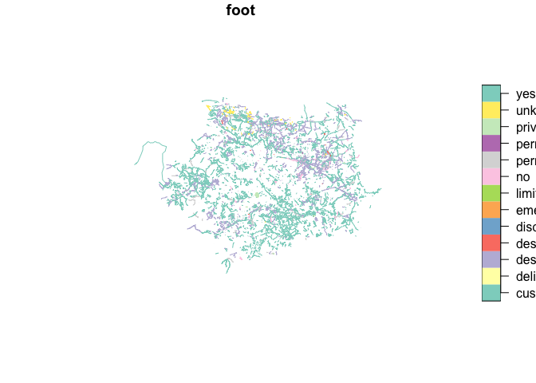
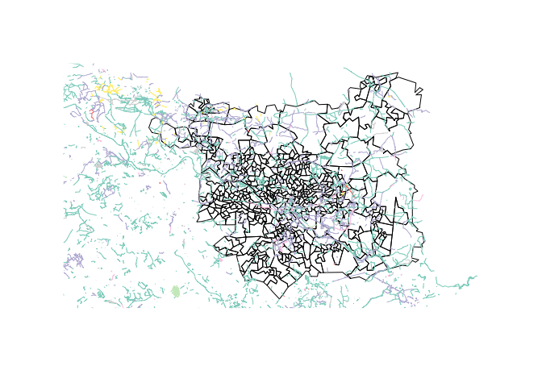
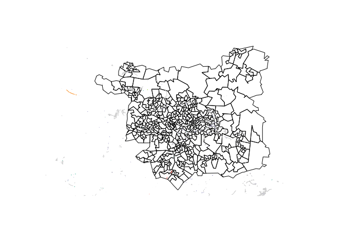
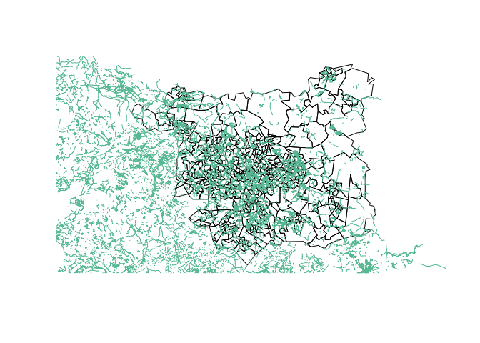
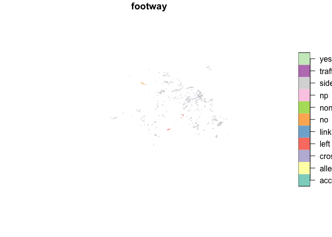
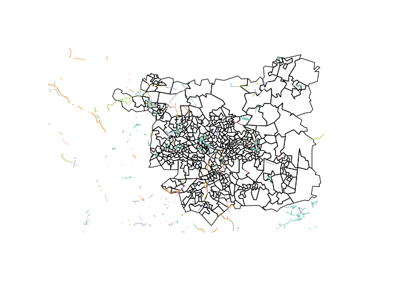
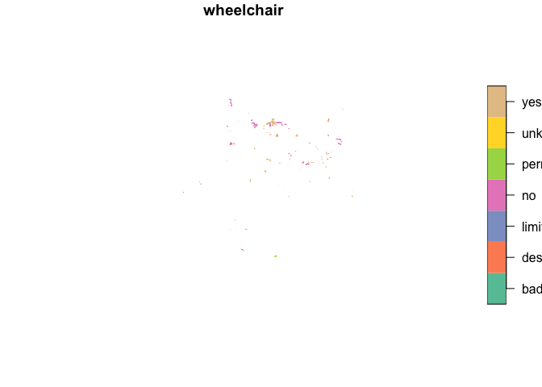
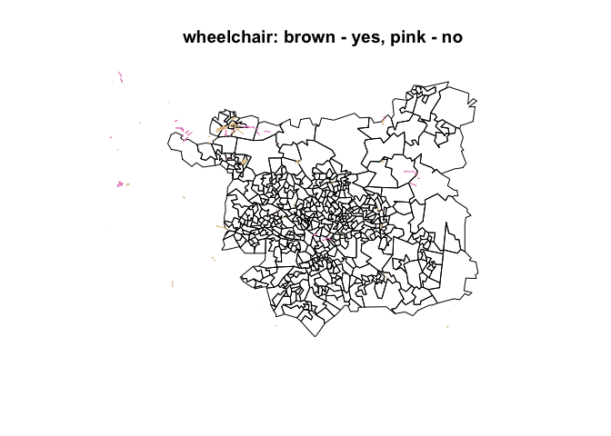

# libraries and data

## libraries

    # load up the libraries
    library(osmextract) 

    ## Data (c) OpenStreetMap contributors, ODbL 1.0. https://www.openstreetmap.org/copyright.
    ## Check the package website, https://docs.ropensci.org/osmextract/, for more details.

    library(tidyverse)

    ## ── Attaching packages ─────────────────────────────────────── tidyverse 1.3.1 ──

    ## ✓ ggplot2 3.3.5     ✓ purrr   0.3.4
    ## ✓ tibble  3.1.5     ✓ dplyr   1.0.7
    ## ✓ tidyr   1.1.4     ✓ stringr 1.4.0
    ## ✓ readr   2.0.2     ✓ forcats 0.5.1

    ## ── Conflicts ────────────────────────────────────────── tidyverse_conflicts() ──
    ## x dplyr::filter() masks stats::filter()
    ## x dplyr::lag()    masks stats::lag()

    library(sf)

    ## Linking to GEOS 3.8.1, GDAL 3.2.1, PROJ 7.2.1

## datasets

Data is limited to West Yorkshire.

    # datasets that will be used throughout this notebook
    # note: you might have to indicate the path to the directory
    wy <- readRDS("wy.Rds") 
    # wy_short <- readRDS("wy_short.Rds")
    # wy_cycling_net <- readRDS("wy_cycling_net.Rds")
    # wy_cn_short <- readRDS("wy_cn_short.Rds")
    wy_pct <- readRDS("wy_pct.Rds")
    leeds <- wy_pct %>% filter(lad_name == "Leeds")
    wy_walking <- readRDS("wy_walking.Rds")
    # wy_walk_short <- readRDS("wy_walking.Rds")

## additional functions

    # My very first function of which I am very proud :)
    # what it does:
    # 1. calculates the ratio of the (sf) column's non-NA cases (rows) to the total number of cases (rows)
    # 2. converts ratio to percentages
    # 3. rounds to 2 significant numbers
    perc_ratio <- function(df = dataframe, x = character()){
    ((df %>% pull(x) %>% table() %>% sum()) / (df %>% nrow()) * 100) %>% 
        signif(digits = 2)
    }

    # a function that returns a table of sf object's column's values sorted decreasingly
    sf_col_table <- function(df = dataframe,
                             x = character()){
      df %>% pull(x) %>% table %>% sort(decreasing = TRUE)
                             }

# cycling

Tags of interest for cycling:

surface maxspeed:type width maxwidth width:lanes

bicycle cycleway cycleway:both cycleway:right cycleway:left
cycleway:both:lane cycleway:left:lane cycleway:right:lane
cycleway:left:width cycleway:right:width oneway:bicycle
cycleway:otherside  
cycleway:otherside:width cycleway:both:width cycleway:oneside
cycleway:oneside:width cycleway:right:oneway cycleway:width
cycleway:surface bicycle\_road cyclestreet cycleway:buffer
cycleway:left:separation:right bicycle:lanes:conditional
bicycle:lanes:forward:conditional cycleway:lane cycleway:left:foot
cycleway:left:oneway  
cycleway:left:segregated  
cycleway:left:seperation:right  
cycleway:proposed  
cycleway:right:separation:left “cycle” “cycleway:est\_width”

# walking + disability

“wheelchair”, “kerb”, “disabled”, “mobility\_scooter”, “handicap”,
“foot”, “lit”, “access”, “sidewalk”, “footway”, “incline”, “smoothness”,
“est\_width”, “ramp”, “sidewalk\_left”, “sidewalk\_right”,
“ramp\_wheelchair”, “footway\_left”, “footway\_right”,  
“footway\_surface”, “priority”, “sidewalk\_both\_surface”, “path”,  
“pedestrian”, “capacity\_disabled”, “sidewalk\_left\_width”,  
“sidewalk\_right\_surface”

    # the code below was used to import the data.

    # et_walking <- c("wheelchair",
    # "kerb",
    # "disabled",
    # "mobility_scooter",
    # "handicap",
    # "foot",
    # "lit", # https://wiki.openstreetmap.org/wiki/Key:lit
    # "access",
    # "sidewalk",
    # "footway",
    # "incline",
    # "smoothness",
    # "est_width",
    # "ramp",
    # "sidewalk_left",
    # "sidewalk_right",
    # "ramp_wheelchair",
    # "footway_left",
    # "footway_right",          
    # "footway_surface", 
    # "priority",
    # "sidewalk_both_surface", 
    # "path",                                   
    # "pedestrian",
    # "capacity_disabled",
    # "sidewalk_left_width",                    
    # "sidewalk_right_surface")
    # 
    # oe_match_pattern("Yorkshire")
    # region_name <- "West Yorkshire"
    # 
    # wy_walking <- osmextract::oe_get(region_name,
    #                                  force_vectortranslate = TRUE,
    #                                  extra_tags = et_walking
    #                                  )

    # ============
    # `wy_walking` is the data we'll use in this section. 

    # wy_walking %>% str() 
    wy_walking %>% names()

    ##  [1] "osm_id"                 "name"                   "highway"               
    ##  [4] "waterway"               "aerialway"              "barrier"               
    ##  [7] "man_made"               "wheelchair"             "kerb"                  
    ## [10] "disabled"               "mobility_scooter"       "handicap"              
    ## [13] "foot"                   "lit"                    "access"                
    ## [16] "sidewalk"               "footway"                "incline"               
    ## [19] "smoothness"             "est_width"              "ramp"                  
    ## [22] "sidewalk_left"          "sidewalk_right"         "ramp_wheelchair"       
    ## [25] "footway_left"           "footway_right"          "footway_surface"       
    ## [28] "priority"               "sidewalk_both_surface"  "path"                  
    ## [31] "pedestrian"             "capacity_disabled"      "sidewalk_left_width"   
    ## [34] "sidewalk_right_surface" "z_order"                "other_tags"            
    ## [37] "geometry"

    wy_walking %>% nrow()

    ## [1] 233598

    wy_walking %>% ncol()

    ## [1] 37

## foot

Legal access restriction for pedestrians.
<https://wiki.openstreetmap.org/wiki/Key:foot>

    foot_perc <- perc_ratio(wy_walking, "foot") # see chunk 3 (or 'additional functions' section)
    foot_perc

    ## [1] 5.3

    sf_col_table(wy_walking, "foot") # see chunk 4 (or 'additional functions' section)

    ## .
    ##         yes  designated  permissive          no     unknown     private 
    ##        7479        3652         516         374         151         123 
    ##   customers destination discouraged    delivery   emergency     limited 
    ##          38          34           3           1           1           1 
    ##      permit 
    ##           1

    wy_walking %>% select(foot) %>% plot

    st_geometry(leeds) %>% plot(reset = FALSE)
    wy_walking %>% select(foot) %>% plot(add = TRUE)

## <tag:footway>

The tag highway=footway is used for mapping minor pathways which are
used mainly or exclusively by pedestrians.
<https://wiki.openstreetmap.org/wiki/Tag:highway%3Dfootway>

    footway_perc <- perc_ratio(wy_walking, "footway") # see chunk 3 (or 'additional functions' section)
    footway_perc

    ## [1] 0.91

    sf_col_table(wy_walking, "footway") # see chunk 4 (or 'additional functions' section)

    ## .
    ##       sidewalk       crossing   access_aisle           left             no 
    ##           1505            505             77             11              9 
    ## traffic_island            yes           none          alley           link 
    ##              6              5              3              1              1 
    ##             np 
    ##              1

    wy_walking %>% select(footway) %>% plot

    st_geometry(leeds) %>% plot(reset = FALSE)
    wy_walking %>% select(footway) %>% plot(add = TRUE)

    wy_walking %>% select(foot) %>% filter(!is.na(foot)) %>% plot(reset= FALSE,
                                         col = "red",
                                         main = "key:footway (green) and key:foot (red)")
    wy_walking %>% select(footway) %>% filter(!is.na(footway)) %>% plot(add = TRUE,
                                            col = "green")

    # the question remains if they intersect

## sidewalk

The sidewalk (or pavement) is that part of a highway set aside for the
use of pedestrians and sometimes also cyclists, separated from the \[W\]
carriageway (or roadway).
<https://wiki.openstreetmap.org/wiki/Sidewalks>

    sidewalk_perc <- perc_ratio(wy_walking, "sidewalk") # see chunk 3 (or 'additional functions' section)
    sidewalk_perc

    ## [1] 0.93

    sf_col_table(wy_walking, "sidewalk") # see chunk 4 (or 'additional functions' section)

    ## .
    ##       both         no       left      right       none   separate     mapped 
    ##        820        452        431        200        163         79         23 
    ##        yes   crossing left;right 
    ##          6          1          1

    wy_walking %>% select(sidewalk) %>% plot

    st_geometry(leeds) %>% plot(reset = FALSE)
    wy_walking %>% select(sidewalk) %>% plot(add = TRUE)

## wheelchair

This tag may be used to mark places or ways that are suitable to be used
with a wheelchair and a person with a disability who uses another
mobility device (like a walker). *It should only be used if you are sure
about it*, this can either be because there’s a special sign or because
of personal experience/someone with a wheelchair told you.
<https://wiki.openstreetmap.org/wiki/Key:wheelchair>

    wheelchair_perc <- perc_ratio(wy_walking, "wheelchair") # see chunk 3 (or 'additional functions' section)
    sidewalk_perc

    ## [1] 0.93

    sf_col_table(wy_walking, "wheelchair") # see chunk 4 (or 'additional functions' section)

    ## .
    ##        yes         no designated    limited        bad permissive    unknown 
    ##        194        113          3          3          2          2          1

    wy_walking %>% select(wheelchair) %>% plot

    st_geometry(leeds) %>% plot(reset = FALSE,
                                main = "wheelchair: brown - yes, pink - no")
    wy_walking %>% select(wheelchair) %>% filter(!is.na(wheelchair)) %>% plot(add = TRUE)

    leeds

    ## Simple feature collection with 482 features and 129 fields
    ## Geometry type: MULTIPOLYGON
    ## Dimension:     XY
    ## Bounding box:  xmin: -1.800362 ymin: 53.699 xmax: -1.292229 ymax: 53.94589
    ## Geodetic CRS:  WGS 84
    ## # A tibble: 482 × 130
    ##    geo_code  geo_name   lad11cd   lad_name   all bicycle  foot car_driver
    ##  * <chr>     <chr>      <chr>     <chr>    <dbl>   <dbl> <dbl>      <dbl>
    ##  1 E01011556 Leeds 015A E08000035 Leeds      756      10    34        519
    ##  2 E01011652 Leeds 024C E08000035 Leeds      671      20    37        459
    ##  3 E01011307 Leeds 103A E08000035 Leeds      640       7    44        431
    ##  4 E01011280 Leeds 008D E08000035 Leeds      879       6    73        588
    ##  5 E01011281 Leeds 059A E08000035 Leeds      868      26    72        494
    ##  6 E01011482 Leeds 056D E08000035 Leeds     1029      48   221        400
    ##  7 E01011274 Leeds 010C E08000035 Leeds      554      12   101        310
    ##  8 E01011276 Leeds 011C E08000035 Leeds      669      14    66        466
    ##  9 E01011277 Leeds 014A E08000035 Leeds      823      13    46        618
    ## 10 E01011275 Leeds 010D E08000035 Leeds      617      10    70        414
    ## # … with 472 more rows, and 122 more variables: car_passenger <dbl>,
    ## #   motorbike <dbl>, train_tube <dbl>, bus <dbl>, taxi_other <dbl>,
    ## #   govtarget_slc <dbl>, govtarget_sic <dbl>, govtarget_slw <dbl>,
    ## #   govtarget_siw <dbl>, govtarget_sld <dbl>, govtarget_sid <dbl>,
    ## #   govtarget_slp <dbl>, govtarget_sip <dbl>, govtarget_slm <dbl>,
    ## #   govtarget_sim <dbl>, govtarget_slpt <dbl>, govtarget_sipt <dbl>,
    ## #   govnearmkt_slc <dbl>, govnearmkt_sic <dbl>, govnearmkt_slw <dbl>, …

## 

    rbind(foot_perc,
          footway_perc,
          sidewalk_perc,
          wheelchair_perc)

    ##                 [,1]
    ## foot_perc       5.30
    ## footway_perc    0.91
    ## sidewalk_perc   0.93
    ## wheelchair_perc 0.14
